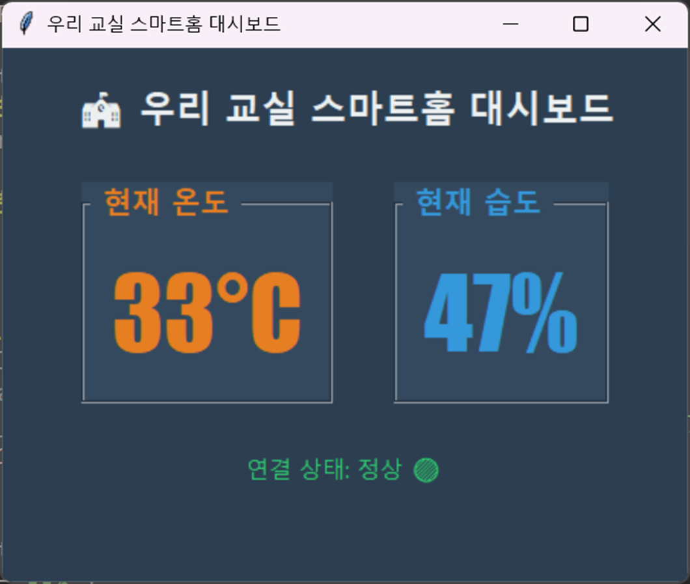

# 🏫 라즈베리파이 피코(Pico)로 만드는 교실 스마트홈 대시보드

이 저장소는 고등학교 1학년 정보 교과 실습을 위한 **[피코 온습도 송신기]** 코드와 **[PC 로컬 GUI 대시보드]** 코드가 포함된 디지털 교재입니다. AI 서비스 및 네트워크 접속 제한을 대비하여 상시 백업 코드를 제공합니다.

---

## 💡 한눈에 보는 작동 원리

우리가 오늘 만드는 시스템은 하드웨어와 소프트웨어가 약속된 규칙(**프로토콜**)에 따라 데이터를 주고받는 원리로 작동합니다.


1. **송신기 (피코):** `DHT11` 센서로 온습도를 측정하여 다른 글자 없이 오직 `숫자,숫자` 형태로만 컴퓨터로 쏩니다.
2. **통신선 (시리얼):** `pyserial` 트럭이 USB 포트를 타고 노트북 안으로 데이터를 실어 나릅니다.
3. **수신기 (PC 대시보드):** 노트북에 들어온 데이터를 `tkinter`가 실시간으로 가로채서 화면에 주황색/파란색 큰 글씨로 그려냅니다.

---

## 🛠️ 실습 코드 복사하기

> ⚠️ **주의:** 코드를 복사할 때는 각 코드 영역 우측 상단의 **[Copy raw contents] (복사 버튼)**을 누르면 줄바꿈이 깨지지 않고 깔끔하게 복사됩니다.

### 🔌 1단계: 피코 송신기 코드 (`pico_sender.py`)
* Thonny 우측 하단을 **`MicroPython (Raspberry Pi Pico)`**로 변경하세요.
* 아래 코드를 복사하여 새 창에 붙여넣은 후, **[라즈베리파이 피코 내부]**에 반드시 파일 이름을 **`main.py`**로 저장하고 실행(▶)하세요.

```python
import machine
import time
import dht

# 1. 하드웨어 설정 (GP18 핀에 DHT11 온습도 센서 연결)
sensor = dht.DHT11(machine.Pin(18))

print("=== 피코 온습도 데이터 발송 시작 ===")

while True:
    try:
        sensor.measure()
        temp = sensor.temperature()
        hum = sensor.humidity()
        
        # [핵심] 오직 '숫자,숫자' 형태로만 출력 (예: 24,55)
        print(f"{temp},{hum}")
        
    except OSError as e:
        print("0,0") 
        
    time.sleep(2)
```

### 💻 2단계: PC 대시보드 GUI 코드 (`dashboard.py`)
* Thonny에서 [File] ➡️ [New]를 눌러 완전히 깨끗한 새 창을 만드세요.
* Thonny 우측 하단을 클릭해서 반드시 Local Python 3 모드로 변신시킵니다!
* 코드의 10번째 줄 PORT = 'COM3' 부분을 내 화면에 떠 있는 고유의 포트 번호(예: COM4, COM5 등)로 수정하여 [내 컴퓨터(This Computer)]에 dashboard.py로 저장하고 실행하세요.

<p align="center">
  
</p>
